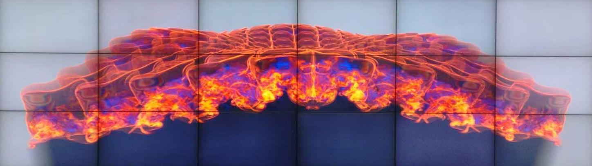

  

    

      

        <h6 class="card-title">Days</h6>
        
Mon, Wed

      

    

  

  

    

      

        <h6 class="card-title">Time</h6>
        
4:35-05:55 PM 

      

    

  

  

    

      

        <h6 class="card-title">Location</h6>
        
WEB 1230

      

    

  

  

    

      

        <h6 class="card-title">Office hours</h6>
        
TBD 

      

    

  

 

**Lecturers**: Dr. Valerio Pascucci and Dr. Steve Petruzza

**TM**: Nathan Morrical, Aniketh Venkat

**Main Text**: [Data Visualization: Principles and Practice, 2nd Edition by Alexandru C. Telea](https://www.amazon.com/Data-Visualization-Principles-Practice-Second-ebook-dp-B00MMOJ314/dp/B00MMOJ314/ref=mt_kindle?_encoding=UTF8&me=&qid=)

### Course Philosophy

Visualization is important to most areas of science, engineering, and medicine. Accordingly, students in this course have a 
variety of backgrounds, expertises, and needs. We will try to cover topics common to many areas of visualization, 
while, at the same time, allowing individuals to learn specific techniques and/or applications via a visualization project. 
Scientific visualization can be approached from an abstract and/or from a practical perspective. In this course, 
we’ll focus on applications in science, engineering, and medicine, while at the same time learning some of the underlying theory.

### Learning Outcomes. Upon completion of CS 5635 / CS 6635, the student should:
* know commonly used algorithms and techniques in scientific visualization,
* have seen and discussed examples of visualization techniques and be able to apply them  in a variety of fields,
* be able to critique the effectiveness of a scientific visualization and propose improvements if needed,
* be able to efficiently use an advanced scientific visualization software system,
* know where to locate and use further visualization resources,
* be knowledgable of current research challenges in scientific visualization and understand in which application they emerge,
* have demonstrated the ability to define and execute a project in scientific visualization. 
    
### Assignments
There are two main types of assignments for this course. One is in the form of in between class homework that will primarily 
consist of using the [ParaView](https://www.paraview.org/) and [OpenViSUS](https://visus.org/) visualization software systems. 
The second will be in the form of a scientific visualization project. This project can be a visualization of data you have collected 
from a simulation and/or experiment, development of a new software tool(s) for visualization, or a theoretical investigation 
of a topic in visualization. The goal is to supply the student with a hands on experience that is as close to real life 
applications as possible within the confines of a semester long class.
Languages: While we will primarily use the ParaView and OpenViSUS visualization systems, ParaView is built upon the 
Visualization Toolkit (vtk), which has versions in C++, Java, and Python, while OpenViSUS has versions in C++, and Python. 
We expect students to be able to program in Python for some assignments.

### Grades
Final course grades will be computed according to 80% Homework and 20% Final Project.
Incompletes: As the project is due by the end of the semester, in past similar project-based courses, 
it has turned out that some people do not wisely schedule their time and do not finish their projects. 
They then want to take an incomplete and finish the project sometime in the summer. 
We only give incompletes very rarely and only for truly unusual circumstances (death in the family, etc.), 
so please plan carefully and work to finish your final project on time.

### Collaboration, Cheating and Plagiarism Policy
You are welcome to discuss the course’s ideas, material, and homework with others in order to better understand it, but the work you turn in must be your own (or for the project, yours and your teammate’s). For example, you must write your own code, design your own visualizations, and critically evaluate the results in your own words. You may not submit the same or similar work to this course that you have submitted or will submit to another. 

In homeworks you must not use code provided on the internet except when explicitly permitted in the instructions.

You are free to use general purpose frameworks or libraries (e.g., matplotlib, numpy, pandas etc.) and acknowledge them with proper citation and provide a link to the source. 

We will use both manual and automatic methods to check your submissions for plagiarism and will also check against online sources and submissions from previous years. For details on the policy, please refer to the [School of Computing Cheating Policy] (https://www.cs.utah.edu/wp-content/uploads/2014/12/cheating_policy.pdf). Plagiarism will lead to a failing grade in this course, two such infractions will lead to a ban on all CS programs.

#### Missed Activities and Assignment Deadlines
All submissions related to projects must be turned in on time. Homeworks are subject to the late day policy stated below. In case of an extenuating circumstance, such as a medical condition, we will ask you to provide documentation directly issued by the University, and we will try to work out an agreeable solution with you (and your team).

#### Late Policy
You can turn in your homework assignments up to two days late, however, for each day that an assignment is turned in late we will deduct 10% off the total possible points. That is, one-day late is 10% off, two-days is 20% off. Submission after two days will be graded 0. We suggest to submit partial solutions to get partial credit.

#### Regrading Policy
It is very important to us that all assignments are properly graded. If you believe there is an error in your assignment grading, please submit an explanation via email to us (via Canvas) within 7 days of receiving the grade. No regrade requests will be accepted orally, and no regrade requests will be accepted more than 7 days after you receive the grade for the assignment.

### General Policies and Code of Conduct

#### Respect for Diversity
It is our intent that students from all diverse backgrounds and perspectives be well-served by this course, that students’ learning needs be addressed both in and out of class, and that the diversity that the students bring to this class be viewed as a resource, strength and benefit. It is our intent to present materials and activities that are respectful of diversity: gender identity, sexuality, disability, age, socioeconomic status, ethnicity, race, nationality, religion, and culture. Your suggestions are encouraged and appreciated. Please let us know ways to improve the effectiveness of the course for you personally, or for other students or student groups.

#### The Americans with Disabilities Act.
The University of Utah seeks to provide equal access to its programs, services, and activities for people with disabilities. If you will need accommodations in this class, reasonable prior notice needs to be given to the Center for Disability Services, 162 Olpin Union Building, (801) 581-5020. CDS will work with you and the instructor to make arrangements for accommodations. All written information in this course can be made available in an alternative format with prior notification to the Center for Disability Services.

#### Addressing Sexual Misconduct.
Title IX makes it clear that violence and harassment based on sex and gender (which Includes sexual orientation and gender identity/expression) is a civil rights offense subject to the same kinds of accountability and the same kinds of support applied to offenses against other protected categories such as race, national origin, color, religion, age, status as a person with a disability, veteran’s status or genetic information. If you or someone you know has been harassed or assaulted, you are encouraged to report it to the Title IX Coordinator in the Office of Equal Opportunity and Affirmative Action, 135 Park Building, 801-581-8365, or the Office of the Dean of Students, 270 Union Building, 801-581-7066. For support and confidential consultation, contact the Center for Student Wellness, 426 SSB, 801-581-7776. To report to the police, contact the Department of Public Safety, 801-585-2677(COPS).

#### Campus Safety
The University of Utah values the safety of all campus community members. To report suspicious activity or to request a courtesy escort, call campus police at 801-585-COPS (801-585-2677). You will receive important emergency alerts and safety messages regarding campus safety via text message. For more information regarding safety and to view available training resources, including helpful videos, visit [safeu.utah.edu](http://safeu.utah.edu).

#### User Notice for Copyrighted Materials on Course Websites
This course website, and all original content provided as part of this course is licensed under the creative commons cc by license. Other content such as text, images, graphics, audio and video clips, (collectively, the "Content"), are protected by copyright law. In some cases, the copyright is owned by third parties, and we are making the third-party content available to you under the fair use doctrine. Fair use permits only certain limited uses of the content. You may use this content only for your personal, noncommercial educational and scholarly use.

### References
1. The ParaView Guide: A Parallel Visualization Application, U. Ayachit, Kitware Press, 2015.
2. OpenVisus [visus.org](https://www.visus.org).
3. Scientific Visualization: Uncertainty, Multifield, Biomedical, and Scalable Visualization, C.D. Hansen, M. Chen, C.R. Johnson, A.E. Kaufman, H. Hagen (Eds.). Mathematics and Visualization, Springer, 2014. ISBN: 978-1-4471-6496-8 
4. The Visualization Toolkit: An Object Oriented Approach to 3D Graphics, W. Schroeder, K. Martin, and B. Lorensen, Prentice Hall Press, 4th Edition, 2006. You can get a free PDF version of the book from [https://www.vtk.org/vtk-textbook/](https://www.vtk.org/vtk-textbook/).
5. The Visualization Handbook, C.D. Hansen and C.R. Johnson, Elsevier, 2005. ISBN: 0-12- 387582-X
6. High Performance Visualization: Enabling Extreme-Scale Scientific Insight, E. Wes Bethel, Hank Childs, Charles Hansen. CRC Press, 2012.
7. IEEE Visualization Conference [ieeevis.org](ieeevis.org).
8. Large Data Analysis and Visualization Symposium [http://ldav.org/](http://ldav.org/).
9. EuroVis Conference [www.eurovis2018.org](http://www.eurovis2018.org).
10. Pacific Visualization Conference [www.pvis.org](http://www.pvis.org).
